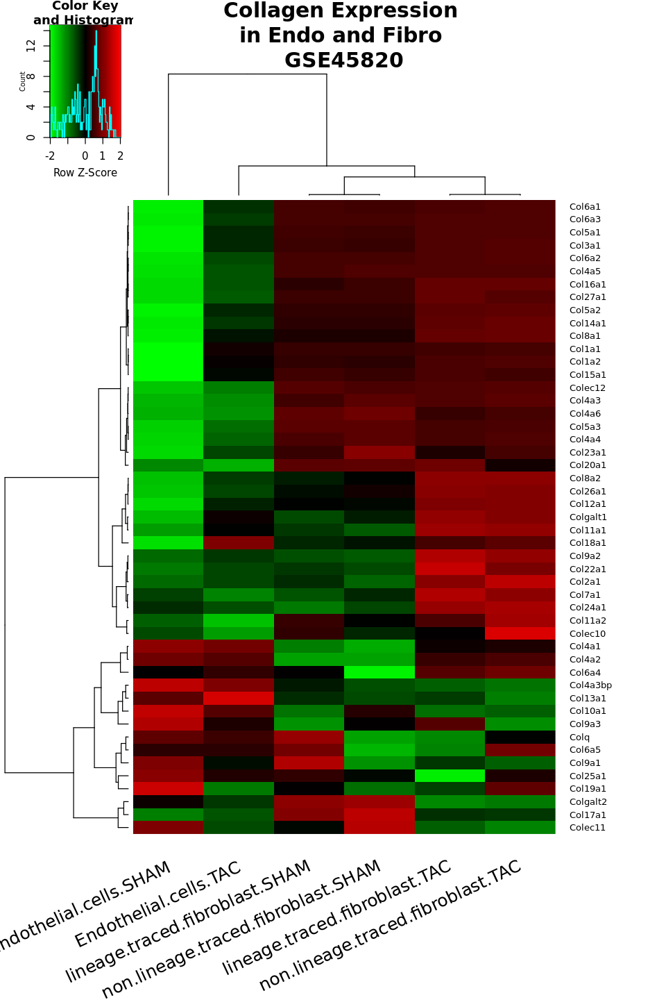

# EndothelialCells_AffiMatrix_GeneExpr_GSE45820

```R
# http://bioconductor.org/packages/release/data/annotation/manuals/mouse4302.db/man/mouse4302.db.pdf
# https://www.ncbi.nlm.nih.gov/geo/query/acc.cgi?acc=GSE45820
```

## download and install tools required for the analysis


```R
if (!requireNamespace("BiocManager", quietly = TRUE))
    install.packages("BiocManager")

BiocManager::install("mouse4302.db")
```

    Bioconductor version 3.10 (BiocManager 1.30.10), R 3.6.2 (2019-12-12)
    
    Installing package(s) 'mouse4302.db'
    
    Old packages: 'bigrquery', 'boot', 'class', 'gargle', 'ggpubr', 'git2r',
      'googleAuthR', 'KernSmooth', 'lsei', 'MASS', 'mnormt', 'modelr', 'nnet',
      'npsurv', 'pillar', 'pkgbuild', 'ps', 'RcppArmadillo', 'RcppParallel',
      'rematch2', 'rlang', 'ROCR', 'scales', 'spatial', 'tidyr', 'tidyselect',
      'usethis', 'vctrs', 'xml2', 'zoo'
    


```R
library(tidyverse)
library(GEOquery)
library(RColorBrewer)
library(mouse4302.db)
library(gplots)
```

## download samples


### metadata info


```R
# Again, with good network access, one would do:
# gse <- getGEO("GSE781",GSEMatrix=FALSE)


gse <- getGEO("GSE45820",GSEMatrix=FALSE)

```

    Using locally cached version of GSE45820 found here:
    /tmp/RtmpuKqlBD/GSE45820.soft.gz 
    
    Reading file....
    
    Parsing....
    
    Found 7 entities...
    
    GPL1261 (1 of 8 entities)
    
    Warning message:
    “64 parsing failures.
      row     col           expected    actual         file
    45038 SPOT_ID 1/0/T/F/TRUE/FALSE --Control literal data
    45039 SPOT_ID 1/0/T/F/TRUE/FALSE --Control literal data
    45040 SPOT_ID 1/0/T/F/TRUE/FALSE --Control literal data
    45041 SPOT_ID 1/0/T/F/TRUE/FALSE --Control literal data
    45042 SPOT_ID 1/0/T/F/TRUE/FALSE --Control literal data
    ..... ....... .................. ......... ............
    See problems(...) for more details.
    ”
    GSM1115968 (2 of 8 entities)
    
    GSM1115969 (3 of 8 entities)
    
    GSM1115970 (4 of 8 entities)
    
    GSM1115971 (5 of 8 entities)
    
    GSM1115972 (6 of 8 entities)
    
    GSM1115973 (7 of 8 entities)
    


```R
head(Meta(gse))
```


<dl>
	<dt>$contact_address</dt>
		<dd>'9500 Gilman Drive #0613C'</dd>
	<dt>$contact_city</dt>
		<dd>'La Jolla'</dd>
	<dt>$contact_country</dt>
		<dd>'USA'</dd>
	<dt>$contact_department</dt>
		<dd>'SSPPS'</dd>
	<dt>$contact_email</dt>
		<dd>'tmooremorris@ucsd.edu'</dd>
	<dt>$contact_institute</dt>
		<dd>'University of California San Diego'</dd>
</dl>


```R
# names of all the GSM objects contained in the GSE
names(GSMList(gse))
```


<style>
.list-inline {list-style: none; margin:0; padding: 0}
.list-inline>li {display: inline-block}
.list-inline>li:not(:last-child)::after {content: "\00b7"; padding: 0 .5ex}
</style>
<ol class=list-inline><li>'GSM1115968'</li><li>'GSM1115969'</li><li>'GSM1115970'</li><li>'GSM1115971'</li><li>'GSM1115972'</li><li>'GSM1115973'</li></ol>


```R
# and get the first GSM object on the list
GSMList(gse)[[1]]
```


    An object of class "GSM"
    channel_count 
    [1] "1"
    characteristics_ch1 
    [1] "cell type: cardiac fibroblasts"  "strain: black swiss"            
    [3] "gender: male"                    "age: 8-10 weeks"                
    [5] "lineage: Tie2cre lineage traced"
    contact_address 
    [1] "9500 Gilman Drive #0613C"
    contact_city 
    [1] "La Jolla"
    contact_country 
    [1] "USA"
    contact_department 
    [1] "SSPPS"
    contact_email 
    [1] "tmooremorris@ucsd.edu"
    contact_institute 
    [1] "University of California San Diego"
    contact_laboratory 
    [1] "Evans"
    contact_name 
    [1] "thomas,,moore-morris"
    contact_state 
    [1] "CA"
    contact_zip/postal_code 
    [1] "92093"
    data_processing 
    [1] "Affymetrix expression values were generated and normalized with RMA using AltAnalyse"
    data_row_count 
    [1] "45101"
    description 
    [1] "Gene expression data from cells sorted from left ventricle"
    extract_protocol_ch1 
    [1] "RNA was extracted from cell pellets using the Zymo Quick RNA microprep according to the manufacturer's instructions."
    geo_accession 
    [1] "GSM1115968"
    growth_protocol_ch1 
    [1] "Mice were maintained in a vivarium under normal conditions."
    hyb_protocol 
    [1] "Following fragmentation, 11 ug of cRNA were hybridized for 16 hr at 45C on Mouse 430 2.0 Array. GeneChips were washed and stained in the Affymetrix Fluidics Station 450."
    label_ch1 
    [1] "biotin"
    label_protocol_ch1 
    [1] "Biotinylated cRNA were prepared according to the standard Affymetrix protocol from 200ng total RNA (Expression Analysis Technical Manual, 2001, Affymetrix)."
    last_update_date 
    [1] "May 19 2014"
    molecule_ch1 
    [1] "total RNA"
    organism_ch1 
    [1] "Mus musculus"
    platform_id 
    [1] "GPL1261"
    scan_protocol 
    [1] "Genechips were scanned using the affymetrix Gene Chip Scanner 3000 7G."
    series_id 
    [1] "GSE45820"
    source_name_ch1 
    [1] "left ventricle, sham operated"
    status 
    [1] "Public on May 19 2014"
    submission_date 
    [1] "Apr 05 2013"
    supplementary_file 
    [1] "ftp://ftp.ncbi.nlm.nih.gov/geo/samples/GSM1115nnn/GSM1115968/suppl/GSM1115968_FibroTie2_S-1.CEL.gz"
    taxid_ch1 
    [1] "10090"
    title 
    [1] "Tie2cre lineage traced fibroblast SHAM, Biological Replicate 1"
    treatment_protocol_ch1 
    [1] "Mice were subjected to transaortic contriction or sham operated."
    type 
    [1] "RNA"
    An object of class "GEODataTable"
    ****** Column Descriptions ******
      Column                                         Description
    1 ID_REF                                                    
    2  VALUE Normalized data from probeset data generated by RMA
    ****** Data Table ******
            ID_REF     VALUE
    1   1415670_at 3696.8992
    2   1415671_at 2217.0107
    3   1415672_at 2360.3253
    4   1415673_at  365.4246
    5 1415674_a_at 1410.6751
    45096 more rows ...


```R
# and the names of the GPLs represented
names(GPLList(gse))
```


'GPL1261'


### same as above but with gene expression parameter set to true:


```R
# Note that GSEMatrix=TRUE is the default
gse45820 <- getGEO('GSE45820',GSEMatrix=TRUE)
show(gse45820)
```

    Found 1 file(s)
    
    GSE45820_series_matrix.txt.gz
    
    Using locally cached version: /tmp/RtmpuKqlBD/GSE45820_series_matrix.txt.gz
    
    Parsed with column specification:
    cols(
      ID_REF = col_character(),
      GSM1115968 = col_double(),
      GSM1115969 = col_double(),
      GSM1115970 = col_double(),
      GSM1115971 = col_double(),
      GSM1115972 = col_double(),
      GSM1115973 = col_double()
    )
    
    Using locally cached version of GPL1261 found here:
    /tmp/RtmpuKqlBD/GPL1261.soft 
    
    Warning message:
    “64 parsing failures.
      row     col           expected    actual         file
    45038 SPOT_ID 1/0/T/F/TRUE/FALSE --Control literal data
    45039 SPOT_ID 1/0/T/F/TRUE/FALSE --Control literal data
    45040 SPOT_ID 1/0/T/F/TRUE/FALSE --Control literal data
    45041 SPOT_ID 1/0/T/F/TRUE/FALSE --Control literal data
    45042 SPOT_ID 1/0/T/F/TRUE/FALSE --Control literal data
    ..... ....... .................. ......... ............
    See problems(...) for more details.
    ”


    $GSE45820_series_matrix.txt.gz
    ExpressionSet (storageMode: lockedEnvironment)
    assayData: 45101 features, 6 samples 
      element names: exprs 
    protocolData: none
    phenoData
      sampleNames: GSM1115968 GSM1115969 ... GSM1115973 (6 total)
      varLabels: title geo_accession ... strain:ch1 (43 total)
      varMetadata: labelDescription
    featureData
      featureNames: 1415670_at 1415671_at ... AFFX-TrpnX-M_at (45101 total)
      fvarLabels: ID GB_ACC ... Gene Ontology Molecular Function (16 total)
      fvarMetadata: Column Description labelDescription
    experimentData: use 'experimentData(object)'
      pubMedIds: 24937432 
    Annotation: GPL1261 
    


```R

show(pData(phenoData(gse45820[[1]]))[1:5,])
```

                                                                            title
    GSM1115968     Tie2cre lineage traced fibroblast SHAM, Biological Replicate 1
    GSM1115969      Tie2cre lineage traced fibroblast TAC, Biological Replicate 1
    GSM1115970 Tie2cre non-lineage traced fibroblast SHAM, Biological Replicate 1
    GSM1115971  Tie2cre non-lineage traced fibroblast TAC, Biological Replicate 1
    GSM1115972                     Endothelial cells SHAM, Biological Replicate 1
               geo_accession                status submission_date last_update_date
    GSM1115968    GSM1115968 Public on May 19 2014     Apr 05 2013      May 19 2014
    GSM1115969    GSM1115969 Public on May 19 2014     Apr 05 2013      May 19 2014
    GSM1115970    GSM1115970 Public on May 19 2014     Apr 05 2013      May 19 2014
    GSM1115971    GSM1115971 Public on May 19 2014     Apr 05 2013      May 19 2014
    GSM1115972    GSM1115972 Public on May 19 2014     Apr 05 2013      May 19 2014
               type channel_count               source_name_ch1 organism_ch1
    GSM1115968  RNA             1 left ventricle, sham operated Mus musculus
    GSM1115969  RNA             1           left ventricle, TAC Mus musculus
    GSM1115970  RNA             1 left ventricle, sham operated Mus musculus
    GSM1115971  RNA             1           left ventricle, TAC Mus musculus
    GSM1115972  RNA             1 left ventricle, sham operated Mus musculus
                               characteristics_ch1 characteristics_ch1.1
    GSM1115968      cell type: cardiac fibroblasts   strain: black swiss
    GSM1115969      cell type: cardiac fibroblasts   strain: black swiss
    GSM1115970      cell type: cardiac fibroblasts   strain: black swiss
    GSM1115971      cell type: cardiac fibroblasts   strain: black swiss
    GSM1115972 cell type: cardiac endothelial cell   strain: black swiss
               characteristics_ch1.2 characteristics_ch1.3
    GSM1115968          gender: male       age: 8-10 weeks
    GSM1115969          gender: male       age: 8-10 weeks
    GSM1115970          gender: male       age: 8-10 weeks
    GSM1115971          gender: male       age: 8-10 weeks
    GSM1115972          gender: male       age: 8-10 weeks
                         characteristics_ch1.4
    GSM1115968 lineage: Tie2cre lineage traced
    GSM1115969 lineage: Tie2cre lineage traced
    GSM1115970    lineage: Tie2cre non-lineage
    GSM1115971    lineage: Tie2cre non-lineage
    GSM1115972                                
                                                         treatment_protocol_ch1
    GSM1115968 Mice were subjected to transaortic contriction or sham operated.
    GSM1115969 Mice were subjected to transaortic contriction or sham operated.
    GSM1115970 Mice were subjected to transaortic contriction or sham operated.
    GSM1115971 Mice were subjected to transaortic contriction or sham operated.
    GSM1115972 Mice were subjected to transaortic contriction or sham operated.
                                                       growth_protocol_ch1
    GSM1115968 Mice were maintained in a vivarium under normal conditions.
    GSM1115969 Mice were maintained in a vivarium under normal conditions.
    GSM1115970 Mice were maintained in a vivarium under normal conditions.
    GSM1115971 Mice were maintained in a vivarium under normal conditions.
    GSM1115972 Mice were maintained in a vivarium under normal conditions.
               molecule_ch1
    GSM1115968    total RNA
    GSM1115969    total RNA
    GSM1115970    total RNA
    GSM1115971    total RNA
    GSM1115972    total RNA
                                                                                                               extract_protocol_ch1
    GSM1115968 RNA was extracted from cell pellets using the Zymo Quick RNA microprep according to the manufacturer's instructions.
    GSM1115969 RNA was extracted from cell pellets using the Zymo Quick RNA microprep according to the manufacturer's instructions.
    GSM1115970 RNA was extracted from cell pellets using the Zymo Quick RNA microprep according to the manufacturer's instructions.
    GSM1115971 RNA was extracted from cell pellets using the Zymo Quick RNA microprep according to the manufacturer's instructions.
    GSM1115972 RNA was extracted from cell pellets using the Zymo Quick RNA microprep according to the manufacturer's instructions.
               label_ch1
    GSM1115968    biotin
    GSM1115969    biotin
    GSM1115970    biotin
    GSM1115971    biotin
    GSM1115972    biotin
                                                                                                                                                         label_protocol_ch1
    GSM1115968 Biotinylated cRNA were prepared according to the standard Affymetrix protocol from 200ng total RNA (Expression Analysis Technical Manual, 2001, Affymetrix).
    GSM1115969 Biotinylated cRNA were prepared according to the standard Affymetrix protocol from 200ng total RNA (Expression Analysis Technical Manual, 2001, Affymetrix).
    GSM1115970 Biotinylated cRNA were prepared according to the standard Affymetrix protocol from 200ng total RNA (Expression Analysis Technical Manual, 2001, Affymetrix).
    GSM1115971 Biotinylated cRNA were prepared according to the standard Affymetrix protocol from 200ng total RNA (Expression Analysis Technical Manual, 2001, Affymetrix).
    GSM1115972 Biotinylated cRNA were prepared according to the standard Affymetrix protocol from 200ng total RNA (Expression Analysis Technical Manual, 2001, Affymetrix).
               taxid_ch1
    GSM1115968     10090
    GSM1115969     10090
    GSM1115970     10090
    GSM1115971     10090
    GSM1115972     10090
                                                                                                                                                                            hyb_protocol
    GSM1115968 Following fragmentation, 11 ug of cRNA were hybridized for 16 hr at 45C on Mouse 430 2.0 Array. GeneChips were washed and stained in the Affymetrix Fluidics Station 450.
    GSM1115969 Following fragmentation, 11 ug of cRNA were hybridized for 16 hr at 45C on Mouse 430 2.0 Array. GeneChips were washed and stained in the Affymetrix Fluidics Station 450.
    GSM1115970 Following fragmentation, 11 ug of cRNA were hybridized for 16 hr at 45C on Mouse 430 2.0 Array. GeneChips were washed and stained in the Affymetrix Fluidics Station 450.
    GSM1115971 Following fragmentation, 11 ug of cRNA were hybridized for 16 hr at 45C on Mouse 430 2.0 Array. GeneChips were washed and stained in the Affymetrix Fluidics Station 450.
    GSM1115972 Following fragmentation, 11 ug of cRNA were hybridized for 16 hr at 45C on Mouse 430 2.0 Array. GeneChips were washed and stained in the Affymetrix Fluidics Station 450.
                                                                        scan_protocol
    GSM1115968 Genechips were scanned using the affymetrix Gene Chip Scanner 3000 7G.
    GSM1115969 Genechips were scanned using the affymetrix Gene Chip Scanner 3000 7G.
    GSM1115970 Genechips were scanned using the affymetrix Gene Chip Scanner 3000 7G.
    GSM1115971 Genechips were scanned using the affymetrix Gene Chip Scanner 3000 7G.
    GSM1115972 Genechips were scanned using the affymetrix Gene Chip Scanner 3000 7G.
                                                              description
    GSM1115968 Gene expression data from cells sorted from left ventricle
    GSM1115969 Gene expression data from cells sorted from left ventricle
    GSM1115970 Gene expression data from cells sorted from left ventricle
    GSM1115971 Gene expression data from cells sorted from left ventricle
    GSM1115972 Gene expression data from cells sorted from left ventricle
                                                                                    data_processing
    GSM1115968 Affymetrix expression values were generated and normalized with RMA using AltAnalyse
    GSM1115969 Affymetrix expression values were generated and normalized with RMA using AltAnalyse
    GSM1115970 Affymetrix expression values were generated and normalized with RMA using AltAnalyse
    GSM1115971 Affymetrix expression values were generated and normalized with RMA using AltAnalyse
    GSM1115972 Affymetrix expression values were generated and normalized with RMA using AltAnalyse
               platform_id         contact_name         contact_email
    GSM1115968     GPL1261 thomas,,moore-morris tmooremorris@ucsd.edu
    GSM1115969     GPL1261 thomas,,moore-morris tmooremorris@ucsd.edu
    GSM1115970     GPL1261 thomas,,moore-morris tmooremorris@ucsd.edu
    GSM1115971     GPL1261 thomas,,moore-morris tmooremorris@ucsd.edu
    GSM1115972     GPL1261 thomas,,moore-morris tmooremorris@ucsd.edu
               contact_laboratory contact_department
    GSM1115968              Evans              SSPPS
    GSM1115969              Evans              SSPPS
    GSM1115970              Evans              SSPPS
    GSM1115971              Evans              SSPPS
    GSM1115972              Evans              SSPPS
                                contact_institute          contact_address
    GSM1115968 University of California San Diego 9500 Gilman Drive #0613C
    GSM1115969 University of California San Diego 9500 Gilman Drive #0613C
    GSM1115970 University of California San Diego 9500 Gilman Drive #0613C
    GSM1115971 University of California San Diego 9500 Gilman Drive #0613C
    GSM1115972 University of California San Diego 9500 Gilman Drive #0613C
               contact_city contact_state contact_zip/postal_code contact_country
    GSM1115968     La Jolla            CA                   92093             USA
    GSM1115969     La Jolla            CA                   92093             USA
    GSM1115970     La Jolla            CA                   92093             USA
    GSM1115971     La Jolla            CA                   92093             USA
    GSM1115972     La Jolla            CA                   92093             USA
                                                                                               supplementary_file
    GSM1115968 ftp://ftp.ncbi.nlm.nih.gov/geo/samples/GSM1115nnn/GSM1115968/suppl/GSM1115968_FibroTie2_S-1.CEL.gz
    GSM1115969 ftp://ftp.ncbi.nlm.nih.gov/geo/samples/GSM1115nnn/GSM1115969/suppl/GSM1115969_FibroTie2_T-1.CEL.gz
    GSM1115970     ftp://ftp.ncbi.nlm.nih.gov/geo/samples/GSM1115nnn/GSM1115970/suppl/GSM1115970_Fibro_S-1.CEL.gz
    GSM1115971     ftp://ftp.ncbi.nlm.nih.gov/geo/samples/GSM1115nnn/GSM1115971/suppl/GSM1115971_Fibro_T-1.CEL.gz
    GSM1115972      ftp://ftp.ncbi.nlm.nih.gov/geo/samples/GSM1115nnn/GSM1115972/suppl/GSM1115972_Endo_S-1.CEL.gz
               data_row_count    age:ch1            cell type:ch1 gender:ch1
    GSM1115968          45101 8-10 weeks      cardiac fibroblasts       male
    GSM1115969          45101 8-10 weeks      cardiac fibroblasts       male
    GSM1115970          45101 8-10 weeks      cardiac fibroblasts       male
    GSM1115971          45101 8-10 weeks      cardiac fibroblasts       male
    GSM1115972          45101 8-10 weeks cardiac endothelial cell       male
                          lineage:ch1  strain:ch1
    GSM1115968 Tie2cre lineage traced black swiss
    GSM1115969 Tie2cre lineage traced black swiss
    GSM1115970    Tie2cre non-lineage black swiss
    GSM1115971    Tie2cre non-lineage black swiss
    GSM1115972                   <NA> black swiss


```R
# here it jumps in this tutorial and makes it hard to follow, talks about a gds set from the beginning
# it takes however the read data
```


```R
# If you have network access, the more typical way to do this
# would be to use this:
gds <- getGEO("GSM1115973") # Endothelial cells TAC, Biological Replicate 1
```

    Using locally cached version of GSM1115973 found here:
    /tmp/RtmpuKqlBD/GSM1115973.soft 
    


```R
gds1 <- getGEO("GSM1115972") # Endothelial cells SHAM, Biological Replicate 1
```

    Using locally cached version of GSM1115972 found here:
    /tmp/RtmpuKqlBD/GSM1115972.soft 
    


```R
show(gds)
```

    An object of class "GSM"
    channel_count 
    [1] "1"
    characteristics_ch1 
    [1] "cell type: cardiac endothelial cell" "strain: black swiss"                
    [3] "gender: male"                        "age: 8-10 weeks"                    
    contact_address 
    [1] "9500 Gilman Drive #0613C"
    contact_city 
    [1] "La Jolla"
    contact_country 
    [1] "USA"
    contact_department 
    [1] "SSPPS"
    contact_email 
    [1] "tmooremorris@ucsd.edu"
    contact_institute 
    [1] "University of California San Diego"
    contact_laboratory 
    [1] "Evans"
    contact_name 
    [1] "thomas,,moore-morris"
    contact_state 
    [1] "CA"
    contact_zip/postal_code 
    [1] "92093"
    data_processing 
    [1] "Affymetrix expression values were generated and normalized with RMA using AltAnalyse"
    data_row_count 
    [1] "45101"
    description 
    [1] "Gene expression data from cells sorted from left ventricle"
    extract_protocol_ch1 
    [1] "RNA was extracted from cell pellets using the Zymo Quick RNA microprep according to the manufacturer's instructions."
    geo_accession 
    [1] "GSM1115973"
    growth_protocol_ch1 
    [1] "Mice were maintained in a vivarium under normal conditions."
    hyb_protocol 
    [1] "Following fragmentation, 11 ug of cRNA were hybridized for 16 hr at 45C on Mouse 430 2.0 Array. GeneChips were washed and stained in the Affymetrix Fluidics Station 450."
    label_ch1 
    [1] "biotin"
    label_protocol_ch1 
    [1] "Biotinylated cRNA were prepared according to the standard Affymetrix protocol from 200ng total RNA (Expression Analysis Technical Manual, 2001, Affymetrix)."
    last_update_date 
    [1] "May 19 2014"
    molecule_ch1 
    [1] "total RNA"
    organism_ch1 
    [1] "Mus musculus"
    platform_id 
    [1] "GPL1261"
    scan_protocol 
    [1] "Genechips were scanned using the affymetrix Gene Chip Scanner 3000 7G."
    series_id 
    [1] "GSE45820"
    source_name_ch1 
    [1] "left ventricle, TAC"
    status 
    [1] "Public on May 19 2014"
    submission_date 
    [1] "Apr 05 2013"
    supplementary_file 
    [1] "ftp://ftp.ncbi.nlm.nih.gov/geo/samples/GSM1115nnn/GSM1115973/suppl/GSM1115973_Endo_T-1.CEL.gz"
    taxid_ch1 
    [1] "10090"
    title 
    [1] "Endothelial cells TAC, Biological Replicate 1"
    treatment_protocol_ch1 
    [1] "Mice were subjected to transaortic contriction or sham operated."
    type 
    [1] "RNA"
    An object of class "GEODataTable"
    ****** Column Descriptions ******
      Column                                         Description
    1 ID_REF                                                    
    2  VALUE Normalized data from probeset data generated by RMA
    ****** Data Table ******
            ID_REF     VALUE
    1   1415670_at 3110.3043
    2   1415671_at 1821.6120
    3   1415672_at 2171.8218
    4   1415673_at  340.0233
    5 1415674_a_at 1231.0042
    45096 more rows ...


```R
## create a DGE matrix
```


```R
gsmplatforms <- lapply(GSMList(gse),function(x) {Meta(x)$platform_id})
head(gsmplatforms)
```


<dl>
	<dt>$GSM1115968</dt>
		<dd>'GPL1261'</dd>
	<dt>$GSM1115969</dt>
		<dd>'GPL1261'</dd>
	<dt>$GSM1115970</dt>
		<dd>'GPL1261'</dd>
	<dt>$GSM1115971</dt>
		<dd>'GPL1261'</dd>
	<dt>$GSM1115972</dt>
		<dd>'GPL1261'</dd>
	<dt>$GSM1115973</dt>
		<dd>'GPL1261'</dd>
</dl>


```R
gsmlist = Filter(function(gsm) {Meta(gsm)$platform_id=='GPL1261'},GSMList(gse))
length(gsmlist)
```


6


```R
Table(gsmlist[[1]])[1:5,]
```


<table>
<caption>A data.frame: 5 × 2</caption>
<thead>
	<tr><th></th><th scope=col>ID_REF</th><th scope=col>VALUE</th></tr>
	<tr><th></th><th scope=col>&lt;chr&gt;</th><th scope=col>&lt;dbl&gt;</th></tr>
</thead>
<tbody>
	<tr><th scope=row>1</th><td>1415670_at  </td><td>3696.8992</td></tr>
	<tr><th scope=row>2</th><td>1415671_at  </td><td>2217.0107</td></tr>
	<tr><th scope=row>3</th><td>1415672_at  </td><td>2360.3253</td></tr>
	<tr><th scope=row>4</th><td>1415673_at  </td><td> 365.4246</td></tr>
	<tr><th scope=row>5</th><td>1415674_a_at</td><td>1410.6751</td></tr>
</tbody>
</table>


```R
Columns(gsmlist[[1]])[1:5,]
```


<table>
<caption>A data.frame: 5 × 2</caption>
<thead>
	<tr><th></th><th scope=col>Column</th><th scope=col>Description</th></tr>
	<tr><th></th><th scope=col>&lt;chr&gt;</th><th scope=col>&lt;fct&gt;</th></tr>
</thead>
<tbody>
	<tr><th scope=row>1</th><td>ID_REF</td><td>                                                   </td></tr>
	<tr><th scope=row>2</th><td>VALUE </td><td>Normalized data from probeset data generated by RMA</td></tr>
	<tr><th scope=row>NA</th><td>NA    </td><td>NA                                                 </td></tr>
	<tr><th scope=row>NA.1</th><td>NA    </td><td>NA                                                 </td></tr>
	<tr><th scope=row>NA.2</th><td>NA    </td><td>NA                                                 </td></tr>
</tbody>
</table>


```R
# get the probeset ordering
probesets <- Table(GPLList(gse)[[1]])$ID
# make the data matrix from the VALUE columns from each GSM
# being careful to match the order of the probesets in the platform
# with those in the GSMs
data.matrix <- do.call('cbind',lapply(gsmlist,function(x) 
                                      {tab <- Table(x)
                                       mymatch <- match(probesets,tab$ID_REF)
                                       return(tab$VALUE[mymatch])
                                     }))
data.matrix <- apply(data.matrix,2,function(x) {as.numeric(as.character(x))})
data.matrix <- log2(data.matrix)
data.matrix[1:5,]
```


<table>
<caption>A matrix: 5 × 6 of type dbl</caption>
<thead>
	<tr><th scope=col>GSM1115968</th><th scope=col>GSM1115969</th><th scope=col>GSM1115970</th><th scope=col>GSM1115971</th><th scope=col>GSM1115972</th><th scope=col>GSM1115973</th></tr>
</thead>
<tbody>
	<tr><td>11.85210</td><td>12.02517</td><td>11.96778</td><td>12.18339</td><td>10.80791</td><td>11.60284</td></tr>
	<tr><td>11.11440</td><td>11.25710</td><td>11.19843</td><td>11.36445</td><td>10.68041</td><td>10.83100</td></tr>
	<tr><td>11.20477</td><td>11.82510</td><td>11.18155</td><td>12.02734</td><td>10.93541</td><td>11.08469</td></tr>
	<tr><td> 8.51343</td><td> 8.74940</td><td> 8.78115</td><td> 9.03760</td><td> 7.27270</td><td> 8.40949</td></tr>
	<tr><td>10.46217</td><td>10.78491</td><td>10.57547</td><td>10.57964</td><td>10.05543</td><td>10.26562</td></tr>
</tbody>
</table>


```R
data.matrix1 <- do.call('cbind',lapply(gsmlist,function(x) 
                                      {tab <- Table(x)
                                       mymatch <- match(probesets,tab$ID_REF)
                                       return(tab$ID_REF[mymatch])
                                     }))
```


```R
df = as.data.frame(data.matrix)
```


```R
rnames = data.matrix1[,1]
```


```R
rm(rownames)
```

    Warning message in rm(rownames):
    “object 'rownames' not found”


```R
rownames(df)  = rnames
```


```R
head(df)
```


<table>
<caption>A data.frame: 6 × 6</caption>
<thead>
	<tr><th></th><th scope=col>GSM1115968</th><th scope=col>GSM1115969</th><th scope=col>GSM1115970</th><th scope=col>GSM1115971</th><th scope=col>GSM1115972</th><th scope=col>GSM1115973</th></tr>
	<tr><th></th><th scope=col>&lt;dbl&gt;</th><th scope=col>&lt;dbl&gt;</th><th scope=col>&lt;dbl&gt;</th><th scope=col>&lt;dbl&gt;</th><th scope=col>&lt;dbl&gt;</th><th scope=col>&lt;dbl&gt;</th></tr>
</thead>
<tbody>
	<tr><th scope=row>1415670_at</th><td>11.85210</td><td>12.02517</td><td>11.96778</td><td>12.18339</td><td>10.80791</td><td>11.60284</td></tr>
	<tr><th scope=row>1415671_at</th><td>11.11440</td><td>11.25710</td><td>11.19843</td><td>11.36445</td><td>10.68041</td><td>10.83100</td></tr>
	<tr><th scope=row>1415672_at</th><td>11.20477</td><td>11.82510</td><td>11.18155</td><td>12.02734</td><td>10.93541</td><td>11.08469</td></tr>
	<tr><th scope=row>1415673_at</th><td> 8.51343</td><td> 8.74940</td><td> 8.78115</td><td> 9.03760</td><td> 7.27270</td><td> 8.40949</td></tr>
	<tr><th scope=row>1415674_a_at</th><td>10.46217</td><td>10.78491</td><td>10.57547</td><td>10.57964</td><td>10.05543</td><td>10.26562</td></tr>
	<tr><th scope=row>1415675_at</th><td>10.73480</td><td>10.87883</td><td>10.75423</td><td>10.82255</td><td>10.01756</td><td>10.50195</td></tr>
</tbody>
</table>


```R
dim(df)
```


<style>
.list-inline {list-style: none; margin:0; padding: 0}
.list-inline>li {display: inline-block}
.list-inline>li:not(:last-child)::after {content: "\00b7"; padding: 0 .5ex}
</style>
<ol class=list-inline><li>45101</li><li>6</li></ol>


```R
df$arrayid = rownames(df)
```

## get gene ids for the microarray annotations


```R
## select() interface:
## Objects in this package can be accessed using the select() interface
## from the AnnotationDbi package. See ?select for details.
## Bimap interface:
x <- mouse4302SYMBOL # mouse4302ENSEMBL
# Get the probe identifiers that are mapped to a gene symbol
mapped_probes <- mappedkeys(x)
# Convert to a list
xx <- as.list(x[mapped_probes])
if(length(xx) > 0) {
# Get the SYMBOL for the first five probes
xx[1:5]
# Get the first one
xx[[1]]
}
```


'Copg1'


```R
df_ids = as.data.frame(unlist(xx))
```


```R
colnames(df_ids)  = "gene_id"
```


```R
df_ids$arrayid = rownames(df_ids) 
```


```R
head(df_ids,1)
```


<table>
<caption>A data.frame: 1 × 2</caption>
<thead>
	<tr><th></th><th scope=col>gene_id</th><th scope=col>arrayid</th></tr>
	<tr><th></th><th scope=col>&lt;fct&gt;</th><th scope=col>&lt;chr&gt;</th></tr>
</thead>
<tbody>
	<tr><th scope=row>1415670_at</th><td>Copg1</td><td>1415670_at</td></tr>
</tbody>
</table>


```R
head(df)
```


<table>
<caption>A data.frame: 6 × 7</caption>
<thead>
	<tr><th></th><th scope=col>GSM1115968</th><th scope=col>GSM1115969</th><th scope=col>GSM1115970</th><th scope=col>GSM1115971</th><th scope=col>GSM1115972</th><th scope=col>GSM1115973</th><th scope=col>arrayid</th></tr>
	<tr><th></th><th scope=col>&lt;dbl&gt;</th><th scope=col>&lt;dbl&gt;</th><th scope=col>&lt;dbl&gt;</th><th scope=col>&lt;dbl&gt;</th><th scope=col>&lt;dbl&gt;</th><th scope=col>&lt;dbl&gt;</th><th scope=col>&lt;chr&gt;</th></tr>
</thead>
<tbody>
	<tr><th scope=row>1415670_at</th><td>11.85210</td><td>12.02517</td><td>11.96778</td><td>12.18339</td><td>10.80791</td><td>11.60284</td><td>1415670_at  </td></tr>
	<tr><th scope=row>1415671_at</th><td>11.11440</td><td>11.25710</td><td>11.19843</td><td>11.36445</td><td>10.68041</td><td>10.83100</td><td>1415671_at  </td></tr>
	<tr><th scope=row>1415672_at</th><td>11.20477</td><td>11.82510</td><td>11.18155</td><td>12.02734</td><td>10.93541</td><td>11.08469</td><td>1415672_at  </td></tr>
	<tr><th scope=row>1415673_at</th><td> 8.51343</td><td> 8.74940</td><td> 8.78115</td><td> 9.03760</td><td> 7.27270</td><td> 8.40949</td><td>1415673_at  </td></tr>
	<tr><th scope=row>1415674_a_at</th><td>10.46217</td><td>10.78491</td><td>10.57547</td><td>10.57964</td><td>10.05543</td><td>10.26562</td><td>1415674_a_at</td></tr>
	<tr><th scope=row>1415675_at</th><td>10.73480</td><td>10.87883</td><td>10.75423</td><td>10.82255</td><td>10.01756</td><td>10.50195</td><td>1415675_at  </td></tr>
</tbody>
</table>


```R
res_df = merge(df, df_ids, by = "arrayid", all = FALSE)
```


```R
res_df
```


<table>
<caption>A data.frame: 37939 × 8</caption>
<thead>
	<tr><th scope=col>arrayid</th><th scope=col>GSM1115968</th><th scope=col>GSM1115969</th><th scope=col>GSM1115970</th><th scope=col>GSM1115971</th><th scope=col>GSM1115972</th><th scope=col>GSM1115973</th><th scope=col>gene_id</th></tr>
	<tr><th scope=col>&lt;chr&gt;</th><th scope=col>&lt;dbl&gt;</th><th scope=col>&lt;dbl&gt;</th><th scope=col>&lt;dbl&gt;</th><th scope=col>&lt;dbl&gt;</th><th scope=col>&lt;dbl&gt;</th><th scope=col>&lt;dbl&gt;</th><th scope=col>&lt;fct&gt;</th></tr>
</thead>
<tbody>
	<tr><td>1415670_at  </td><td>11.85210</td><td>12.02517</td><td>11.96778</td><td>12.18339</td><td>10.80791</td><td>11.60284</td><td>Copg1   </td></tr>
	<tr><td>1415671_at  </td><td>11.11440</td><td>11.25710</td><td>11.19843</td><td>11.36445</td><td>10.68041</td><td>10.83100</td><td>Atp6v0d1</td></tr>
	<tr><td>1415672_at  </td><td>11.20477</td><td>11.82510</td><td>11.18155</td><td>12.02734</td><td>10.93541</td><td>11.08469</td><td>Golga7  </td></tr>
	<tr><td>1415673_at  </td><td> 8.51343</td><td> 8.74940</td><td> 8.78115</td><td> 9.03760</td><td> 7.27270</td><td> 8.40949</td><td>Psph    </td></tr>
	<tr><td>1415674_a_at</td><td>10.46217</td><td>10.78491</td><td>10.57547</td><td>10.57964</td><td>10.05543</td><td>10.26562</td><td>Trappc4 </td></tr>
	<tr><td>1415675_at  </td><td>10.73480</td><td>10.87883</td><td>10.75423</td><td>10.82255</td><td>10.01756</td><td>10.50195</td><td>Dpm2    </td></tr>
	<tr><td>1415676_a_at</td><td>11.00268</td><td>11.38440</td><td>11.28897</td><td>11.14408</td><td>10.13925</td><td>11.22971</td><td>Psmb5   </td></tr>
	<tr><td>1415677_at  </td><td>10.22159</td><td>10.41758</td><td>10.54445</td><td>10.40605</td><td> 8.93468</td><td>10.16045</td><td>Dhrs1   </td></tr>
	<tr><td>1415678_at  </td><td>11.10780</td><td>11.33195</td><td>11.50582</td><td>11.77698</td><td>10.44037</td><td>10.89799</td><td>Ppm1a   </td></tr>
	<tr><td>1415679_at  </td><td>11.95888</td><td>11.75206</td><td>11.73269</td><td>11.38556</td><td>11.65032</td><td>11.86057</td><td>Psenen  </td></tr>
	<tr><td>1415680_at  </td><td> 9.70484</td><td>10.00440</td><td> 9.86648</td><td>10.29652</td><td> 9.33450</td><td> 9.93519</td><td>Anapc1  </td></tr>
	<tr><td>1415681_at  </td><td>10.15967</td><td>10.45832</td><td>10.26193</td><td>10.18554</td><td> 9.63840</td><td>10.09857</td><td>Mrpl43  </td></tr>
	<tr><td>1415682_at  </td><td> 9.64785</td><td> 9.63242</td><td> 9.76979</td><td> 9.63546</td><td> 9.60635</td><td> 9.68345</td><td>Xpo7    </td></tr>
	<tr><td>1415683_at  </td><td>10.59612</td><td>10.76774</td><td>10.47576</td><td>10.83707</td><td>10.07799</td><td>10.85379</td><td>Nmt1    </td></tr>
	<tr><td>1415684_at  </td><td> 7.08813</td><td> 7.86932</td><td> 7.64689</td><td> 8.27235</td><td> 7.14546</td><td> 7.48803</td><td>Atg5    </td></tr>
	<tr><td>1415685_at  </td><td> 8.22997</td><td> 8.58060</td><td> 8.53661</td><td> 8.88460</td><td> 7.96202</td><td> 8.43676</td><td>Mtif2   </td></tr>
	<tr><td>1415686_at  </td><td>11.51018</td><td>11.35167</td><td>11.45003</td><td>11.50533</td><td>11.37908</td><td>11.54737</td><td>Rab14   </td></tr>
	<tr><td>1415687_a_at</td><td>10.68501</td><td>10.91054</td><td>10.88556</td><td>10.66492</td><td>12.03456</td><td>11.99477</td><td>Psap    </td></tr>
	<tr><td>1415688_at  </td><td> 9.39442</td><td> 9.57517</td><td> 9.35556</td><td> 9.85246</td><td> 9.53995</td><td> 9.29473</td><td>Ube2g1  </td></tr>
	<tr><td>1415689_s_at</td><td> 9.48667</td><td> 9.10074</td><td> 9.27589</td><td> 9.34750</td><td>10.31318</td><td> 9.35210</td><td>Zkscan3 </td></tr>
	<tr><td>1415690_at  </td><td> 9.94865</td><td>10.32055</td><td>10.15843</td><td>10.24296</td><td> 9.08646</td><td>10.02861</td><td>Mrpl27  </td></tr>
	<tr><td>1415691_at  </td><td>10.54957</td><td>10.47369</td><td>10.69067</td><td>10.69744</td><td> 9.85647</td><td> 9.52818</td><td>Dlg1    </td></tr>
	<tr><td>1415692_s_at</td><td>11.85804</td><td>11.66380</td><td>11.82949</td><td>12.13602</td><td>11.33731</td><td>11.51577</td><td>Canx    </td></tr>
	<tr><td>1415693_at  </td><td>11.01938</td><td>10.75407</td><td>11.16145</td><td>10.97407</td><td>10.38621</td><td>10.29158</td><td>Derl1   </td></tr>
	<tr><td>1415694_at  </td><td> 9.25683</td><td> 9.22542</td><td> 9.43272</td><td> 9.31790</td><td>10.86619</td><td> 9.87986</td><td>Wars    </td></tr>
	<tr><td>1415695_at  </td><td>10.44933</td><td>10.58566</td><td>10.58920</td><td>10.96394</td><td>10.67976</td><td>10.97483</td><td>Psma1   </td></tr>
	<tr><td>1415696_at  </td><td>12.99560</td><td>13.12558</td><td>13.25937</td><td>13.30852</td><td>12.15319</td><td>12.51531</td><td>Sar1a   </td></tr>
	<tr><td>1415697_at  </td><td>10.14214</td><td>10.43665</td><td>10.13681</td><td>10.72610</td><td>10.02288</td><td>11.11834</td><td>G3bp2   </td></tr>
	<tr><td>1415698_at  </td><td> 9.26829</td><td>10.46325</td><td> 9.46119</td><td>10.78565</td><td> 8.83455</td><td>10.17242</td><td>Golm1   </td></tr>
	<tr><td>1415699_a_at</td><td>10.65966</td><td>10.77135</td><td>10.68856</td><td>11.03115</td><td> 9.97660</td><td>10.17529</td><td>Gps1    </td></tr>
	<tr><td>⋮</td><td>⋮</td><td>⋮</td><td>⋮</td><td>⋮</td><td>⋮</td><td>⋮</td><td>⋮</td></tr>
	<tr><td>1460729_at                   </td><td>10.23772</td><td>10.37022</td><td>10.51609</td><td>10.55323</td><td>11.09627</td><td>11.20581</td><td>Rock1        </td></tr>
	<tr><td>1460730_at                   </td><td> 8.85923</td><td> 9.19739</td><td> 9.10384</td><td> 9.39089</td><td> 8.64711</td><td> 9.26901</td><td>Eif2b1       </td></tr>
	<tr><td>1460731_at                   </td><td> 9.81861</td><td> 9.48517</td><td> 9.70168</td><td> 9.26053</td><td> 8.68026</td><td> 8.77041</td><td>Slc35c2      </td></tr>
	<tr><td>1460732_a_at                 </td><td> 8.96237</td><td> 5.98101</td><td> 9.61250</td><td> 6.23865</td><td> 5.84641</td><td> 5.47670</td><td>Ppl          </td></tr>
	<tr><td>1460733_at                   </td><td>10.78659</td><td>10.71740</td><td>11.14098</td><td>10.93256</td><td>10.56769</td><td>10.99849</td><td>Unc119b      </td></tr>
	<tr><td>1460734_at                   </td><td> 7.32010</td><td> 7.51470</td><td> 7.34893</td><td> 7.45315</td><td> 6.60787</td><td> 6.75047</td><td>Col9a3       </td></tr>
	<tr><td>1460735_at                   </td><td> 9.42478</td><td> 9.48941</td><td> 9.50400</td><td> 9.67273</td><td> 8.87535</td><td> 8.92758</td><td>Svil         </td></tr>
	<tr><td>1460736_at                   </td><td> 8.10661</td><td> 8.41497</td><td> 8.68331</td><td> 8.51798</td><td> 7.98017</td><td> 8.12977</td><td>Bod1l        </td></tr>
	<tr><td>1460737_at                   </td><td>10.43268</td><td>10.95980</td><td>10.74607</td><td>11.12112</td><td> 9.59250</td><td>10.80253</td><td>Igbp1        </td></tr>
	<tr><td>1460738_at                   </td><td> 6.65588</td><td> 6.50972</td><td> 6.62485</td><td> 6.44053</td><td> 6.86209</td><td> 6.68920</td><td>Limd2        </td></tr>
	<tr><td>1460739_at                   </td><td> 9.36579</td><td> 9.07013</td><td> 9.33023</td><td> 9.10936</td><td> 9.50769</td><td> 9.33881</td><td>Zmiz2        </td></tr>
	<tr><td>1460740_at                   </td><td> 8.58101</td><td> 8.66535</td><td> 9.04850</td><td> 9.06585</td><td> 9.24547</td><td> 9.61760</td><td>Cltb         </td></tr>
	<tr><td>1460741_x_at                 </td><td> 9.22044</td><td> 9.31651</td><td> 9.82150</td><td> 9.48050</td><td> 8.86898</td><td> 9.20943</td><td>Ilrun        </td></tr>
	<tr><td>1460742_at                   </td><td> 9.40136</td><td> 9.94840</td><td> 9.49459</td><td> 9.81425</td><td> 9.29586</td><td> 9.52108</td><td>Alg3         </td></tr>
	<tr><td>1460743_at                   </td><td> 6.10420</td><td> 6.42833</td><td> 6.24828</td><td> 6.47137</td><td> 6.34869</td><td> 6.18480</td><td>Tigd5        </td></tr>
	<tr><td>1460745_at                   </td><td> 4.51394</td><td> 3.75843</td><td> 4.11889</td><td> 4.18473</td><td> 4.48931</td><td> 4.05691</td><td>A630038E17Rik</td></tr>
	<tr><td>1460746_at                   </td><td> 5.49125</td><td> 4.65437</td><td> 4.83336</td><td> 5.13464</td><td> 5.89979</td><td> 5.28193</td><td>Fignl1       </td></tr>
	<tr><td>AFFX-b-ActinMur/M12481_3_at  </td><td>13.47944</td><td>13.39845</td><td>13.36642</td><td>13.33778</td><td>14.00420</td><td>13.98651</td><td>Actb         </td></tr>
	<tr><td>AFFX-b-ActinMur/M12481_5_at  </td><td>13.76408</td><td>13.71489</td><td>13.63302</td><td>13.47344</td><td>14.11778</td><td>14.10239</td><td>Actb         </td></tr>
	<tr><td>AFFX-b-ActinMur/M12481_M_at  </td><td>13.30658</td><td>13.29755</td><td>13.23148</td><td>13.16551</td><td>13.85944</td><td>13.86946</td><td>Actb         </td></tr>
	<tr><td>AFFX-GapdhMur/M32599_3_at    </td><td>13.45561</td><td>13.63238</td><td>13.55906</td><td>13.89703</td><td>13.46617</td><td>13.89304</td><td>Gapdh        </td></tr>
	<tr><td>AFFX-GapdhMur/M32599_5_at    </td><td>12.26685</td><td>12.37653</td><td>12.22419</td><td>11.79870</td><td>12.10953</td><td>12.77182</td><td>Gapdh        </td></tr>
	<tr><td>AFFX-GapdhMur/M32599_M_at    </td><td>12.60682</td><td>12.87178</td><td>12.78194</td><td>12.75283</td><td>12.39500</td><td>13.22913</td><td>Gapdh        </td></tr>
	<tr><td>AFFX-PyruCarbMur/L09192_3_at </td><td> 7.59022</td><td> 8.02421</td><td> 7.79680</td><td> 8.05855</td><td> 6.77582</td><td> 7.09887</td><td>Pcx          </td></tr>
	<tr><td>AFFX-PyruCarbMur/L09192_5_at </td><td> 6.70407</td><td> 6.39997</td><td> 6.32094</td><td> 6.32389</td><td> 6.67503</td><td> 6.46570</td><td>Pcx          </td></tr>
	<tr><td>AFFX-PyruCarbMur/L09192_MA_at</td><td> 6.93616</td><td> 6.49710</td><td> 6.56440</td><td> 6.78049</td><td> 7.27367</td><td> 6.78986</td><td>Pcx          </td></tr>
	<tr><td>AFFX-PyruCarbMur/L09192_MB_at</td><td> 6.39871</td><td> 6.16718</td><td> 6.28103</td><td> 6.29022</td><td> 6.03263</td><td> 6.27865</td><td>Pcx          </td></tr>
	<tr><td>AFFX-TransRecMur/X57349_3_at </td><td> 4.54564</td><td> 4.64944</td><td> 4.33658</td><td> 4.94605</td><td> 5.89846</td><td> 6.84979</td><td>Tfrc         </td></tr>
	<tr><td>AFFX-TransRecMur/X57349_5_at </td><td> 5.28630</td><td> 5.30850</td><td> 4.75938</td><td> 5.02461</td><td> 6.87097</td><td> 8.04375</td><td>Tfrc         </td></tr>
	<tr><td>AFFX-TransRecMur/X57349_M_at </td><td> 5.16835</td><td> 5.47385</td><td> 5.14292</td><td> 5.51249</td><td> 6.33261</td><td> 6.98324</td><td>Tfrc         </td></tr>
</tbody>
</table>


```R
# remove the AFFX - control columns
```


```R
res_df = res_df[!(grepl(res_df$arrayid, pattern = "AFFX")),]
```


```R
length(unique(res_df$gene_id))
```


20508


```R
# how to treat multiple gene entries?
# https://www.thermofisher.com/search/supportSearch?navId=4294959582&query=genechip+products
# use highest variation within the values and take those with the highest variation 
#res_df[,6:7] # take the columns of the sham vs MI
res_df$var = apply(res_df[,6:7], 1, var)
```


```R
res_df_ordered = res_df %>% arrange(desc(var))
```


```R
res_fin = res_df_ordered[which(!(duplicated(res_df_ordered$gene_id ))),]
```


```R
length(unique(res_fin$gene_id)) == nrow(res_fin)
```


TRUE


## plot the data by heatmap


```R
clus_wd2 <- function(x) {
    hclust(x, method = "ward.D2")
}


# define the colors of the samples
redblackgreen <- colorRampPalette(c("green", "black", "red"))(n = 100)

dist_cor <- function(x) {
    as.dist(1 - cor(t(x), method = "pearson"))
}
```


```R
samples = c("lineage traced fibroblast SHAM", "lineage traced fibroblast TAC", "non-lineage traced fibroblast SHAM",
           "non-lineage traced fibroblast TAC", "Endothelial cells SHAM", "Endothelial cells TAC")
```


```R
names = c("arrayid","lineage traced fibroblast SHAM", "lineage traced fibroblast TAC", "non-lineage traced fibroblast SHAM",
           "non-lineage traced fibroblast TAC", "Endothelial cells SHAM", "Endothelial cells TAC", "gene_id", "variation")
```


```R
colnames(res_fin) = names
```


```R
write.table(x = res_fin, 
            file = "/home/jupyter-user/data/public/forRatMIstudy/GSE45820/processed_df_GSE45820.txt", 
            sep = "\t", row.names = F) 
```


```R
res_fin = read.csv("/home/jupyter-user/data/public/forRatMIstudy/GSE45820/processed_df_GSE45820.txt", sep = "\t")
```


```R
collagen = res_fin[which(grepl(x = res_fin$gene_id, pattern = "Col")),]
```


```R
rownames(collagen) = collagen$gene_id
```


```R
head(collagen,2)
```


<table>
<caption>A data.frame: 2 × 9</caption>
<thead>
	<tr><th></th><th scope=col>arrayid</th><th scope=col>lineage.traced.fibroblast.SHAM</th><th scope=col>lineage.traced.fibroblast.TAC</th><th scope=col>non.lineage.traced.fibroblast.SHAM</th><th scope=col>non.lineage.traced.fibroblast.TAC</th><th scope=col>Endothelial.cells.SHAM</th><th scope=col>Endothelial.cells.TAC</th><th scope=col>gene_id</th><th scope=col>variation</th></tr>
	<tr><th></th><th scope=col>&lt;fct&gt;</th><th scope=col>&lt;dbl&gt;</th><th scope=col>&lt;dbl&gt;</th><th scope=col>&lt;dbl&gt;</th><th scope=col>&lt;dbl&gt;</th><th scope=col>&lt;dbl&gt;</th><th scope=col>&lt;dbl&gt;</th><th scope=col>&lt;fct&gt;</th><th scope=col>&lt;dbl&gt;</th></tr>
</thead>
<tbody>
	<tr><th scope=row>Col1a2</th><td>1423110_at</td><td>13.13436</td><td>13.81820</td><td>13.07363</td><td>13.92640</td><td>6.32063</td><td>12.21392</td><td>Col1a2</td><td>17.36543</td></tr>
	<tr><th scope=row>Col1a1</th><td>1423669_at</td><td>13.81194</td><td>14.05547</td><td>13.82519</td><td>14.09493</td><td>7.59059</td><td>13.07231</td><td>Col1a1</td><td>15.02463</td></tr>
</tbody>
</table>


```R
collagen = collagen[,c(2:7)]
```


```R
collagen = as.matrix(collagen)
```


```R
# define the samples to the colors
#class_labels <- ifelse(res_fin$  == "NEG", "grey80", "grey20")

```


```R
options(repr.plot.width=8, repr.plot.height=12)
heatmap.2(collagen,
          # clustering
          distfun = dist_cor, 
          hclust = clus_wd2,
          # scaling (genes are in rows)
          scale = "row",
          # color
          col = redblackgreen,
          # header
          main ="Collagen Expression \nin Endo. and Fibro. \nGSE45820",
          keysize = 1,
          trace = "none",
          margins=c(12,8),
          srtCol=25)
```




